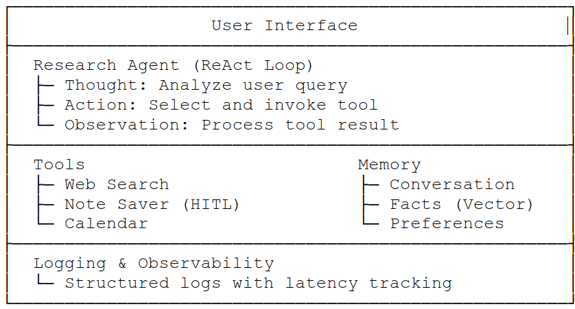

# Week 1: LLM Foundations & Core Agentic Patterns

**Theme:** Foundations & Core Patterns — LLM fundamentals, prompting, memory/state, tool calling, first agent build.

**Daily commitment:** 6–8 hours. Format: Self-paced reading → Hands-on exercises → Mini-project.

---

## Day 1: Understanding How LLMs Work

**Learning Objectives**

- Understand the transformer architecture and how LLMs generate text
- Master key inference parameters: temperature, top-p, top-k sampling
- Recognize why traditional deterministic testing fails with LLMs
- Understand the training lifecycle: pre-training → fine-tuning → RLHF/DPO

**Core Concepts**

| Concept            | Description                                                | Impact on Agents                                               |
| ------------------ | ---------------------------------------------------------- | -------------------------------------------------------------- |
| Product AI patterns         | Assist vs automate, UX flows, failure modes           | Prevents "AI demo syndrome" |
| Temperature        | Controls randomness in token selection (0.0–2.0)           | 0.0–0.3 for deterministic tool use; 0.7–1.0 for creative tasks |
| Top-p (Nucleus)    | Samples from tokens until cumulative probability threshold | More dynamic diversity than fixed top-k                        |
| Context Window     | Maximum tokens model can process                           | Gemini 2M, Claude 200K, GPT-4o 128K–1M                         |
| Pre-training       | Learning patterns from massive text corpora                | Base knowledge and language capabilities                       |
| Fine-tuning        | Adapting to specific tasks/domains                         | Custom agent behaviors                                         |
| RLHF               | Aligning outputs with human preferences                    | Safety, helpfulness, instruction-following                      |
| Structured outputs | Model responses constrained to a JSON schema you define    | Reliable parsing for agents; no manual validation/retries       |
| RAG Architecture & Evaluation | Embeddings, retrieval, reranking, Golden sets, regression tests |  Domain grounding and   Prevents hallucinations    |

**Hands-On**

- Temperature Comparison: Same prompt at temperatures 0.1, 0.5, 1.0; document variance across 5 runs each.
- Token Economics Calculator: Estimate cost for prompt/response pair across GPT-4o, Claude 3.5 Sonnet, Gemini 2.5 Pro.

**Resources**

- OpenAI API Introduction — [https://platform.openai.com/docs/introduction](https://platform.openai.com/docs/introduction)
- Product AI patterns — [OpenAI Production Best Practices](https://platform.openai.com/docs/guides/production-best-practices)
- Andrej Karpathy: State of GPT — [https://www.youtube.com/watch?v=bZQun8Y4L2A](https://www.youtube.com/watch?v=bZQun8Y4L2A)
- Anthropic: Constitutional AI Paper — [https://www.anthropic.com/research/constitutional-ai-harmlessness-from-ai-feedback](https://www.anthropic.com/research/constitutional-ai-harmlessness-from-ai-feedback)
- LLM Parameters Explained — [https://txt.cohere.com/llm-parameters-best-outputs-language-ai/](https://txt.cohere.com/llm-parameters-best-outputs-language-ai/)
- LLM Fundamentals - [ChatGPT Prompt Engineering](https://www.deeplearning.ai/short-courses/chatgpt-prompt-engineering-for-developers/)
- Structured outputs - [Structured model outputs \| OpenAI API](https://developers.openai.com/api/docs/guides/structured-outputs)
- RAG architecture - [OpenAI Retrieval](https://platform.openai.com/docs/guides/retrieval)
- RAG evaluation - [Evaluating RAG (OpenAI Cookbook)](https://cookbook.openai.com/examples/evaluating_rag_with_llamaindex)

**Glossary Terms to Master:** Transformer, Attention Mechanism, Tokenization, BPE, Softmax, Logits, Greedy Decoding, Beam Search, LoRA, QLoRA, PEFT, DPO, Constitutional AI

---

## Day 2: Prompt Engineering for Agents

**Learning Objectives**

- Master structured output formats: JSON, YAML, TOON
- Understand and implement reasoning patterns: Chain-of-Thought, ReAct, Reflexion
- Design effective system prompts for agent roles
- Learn validation techniques for reliable structured outputs

**Core Prompting Patterns**

| Pattern                | Structure                           | Best For                       |
| ---------------------- | ----------------------------------- | ------------------------------ |
| Zero-shot              | Direct instruction without examples | Simple, well-defined tasks     |
| Few-shot               | 2–5 examples before the task        | Complex formatting, edge cases |
| Chain-of-Thought (CoT) | "Let's think step by step..."       | Math, reasoning, planning      |
| ReAct                  | Thought → Action → Observation loop | Tool-using agents              |
| Reflexion              | ReAct + self-critique + memory      | Learning from mistakes         |

**Hands-On**

- ReAct Agent Simulation: Prompt that makes the LLM follow Thought→Action→Observation (e.g. weather + clothing recommendation).
- Structured Output Validator: Prompt that reliably returns JSON; test with 20 inputs; apply Pydantic validation.
- TOON Experiment: Convert 10-row tabular dataset to TOON; compare token usage vs JSON.

**Resources**

- Prompt Engineering Guide — [https://www.promptingguide.ai/](https://www.promptingguide.ai/)
- OpenAI Structured Outputs — [https://platform.openai.com/docs/guides/structured-outputs](https://platform.openai.com/docs/guides/structured-outputs)
- ReAct: Reasoning + Acting — [https://arxiv.org/abs/2210.03629](https://arxiv.org/abs/2210.03629)
- Anthropic Prompt Engineering — [https://docs.anthropic.com/en/docs/build-with-claude/prompt-engineering/overview](https://docs.anthropic.com/en/docs/build-with-claude/prompt-engineering/overview)
- TOON Format Introduction — [https://dev.to/akki907/toon-vs-json-the-new-format-designed-for-ai-nk5](https://dev.to/akki907/toon-vs-json-the-new-format-designed-for-ai-nk5)

**Deliverable:** Documented prompt library with at least 5 reusable prompt templates.

---

## Day 3: Memory & State Management

**Learning Objectives**

- Understand memory taxonomy: short-term, long-term, episodic, semantic, procedural
- Implement conversation memory with summarization
- Design state schemas for complex agent workflows
- Master checkpointing for durable agent execution

**Memory Architecture for Agents**

| Memory Type | Persistence    | Use Case                        | Implementation                 |
| ----------- | -------------- | ------------------------------- | ------------------------------ |
| Short-term  | Single session | Current conversation context    | Buffer in context window       |
| Long-term   | Cross-session  | User preferences, learned facts | Vector DB (ChromaDB, Pinecone) |
| Episodic    | Cross-session  | Past interaction examples       | Few-shot retrieval             |
| Semantic    | Permanent      | Domain knowledge                | Knowledge graphs, RAG          |
| Procedural  | Evolving       | System prompts, behaviors       | Version-controlled prompts     |

**Hands-On**

- Conversation Summarizer: Chatbot that summarizes history when it exceeds 2000 tokens.
- Vector Memory Integration: Long-term memory with ChromaDB or FAISS; store and retrieve user facts.
- State Checkpoint Demo: LangGraph SqliteSaver — agent that can be interrupted and resumed.

**Resources**

- LangChain Memory Types — [https://python.langchain.com/docs/concepts/memory/](https://python.langchain.com/docs/concepts/memory/)
- LangGraph State Management — [https://langchain-ai.github.io/langgraph/concepts/low_level/#state](https://langchain-ai.github.io/langgraph/concepts/low_level/#state)
- CoALA: Cognitive Agent Architecture — [https://arxiv.org/abs/2309.02427](https://arxiv.org/abs/2309.02427)
- ChromaDB Quickstart — [https://docs.trychroma.com/getting-started](https://docs.trychroma.com/getting-started)
- Inference engineering — Latency, caching, routing, cost [OpenAI Latency Optimization](https://platform.openai.com/docs/guides/latency-optimization)

**Deliverable:** Memory-enabled chatbot that persists user preferences across sessions.

---

## Day 4: Tool Calling & Function Integration

**Learning Objectives**

- Design tool schemas that LLMs can reliably invoke
- Implement tool calling with OpenAI, Claude, and open-source models
- Handle tool errors gracefully with retry logic
- Understand tool selection strategies for large toolsets

**Tool Selection Strategies**

| Tool Count  | Strategy            | Implementation                                  |
| ----------- | ------------------- | ----------------------------------------------- |
| < 10 tools  | All in context      | Include all tool schemas in every request       |
| 10–50 tools | Categorized routing | Classify intent, then load relevant tool subset |
| 50+ tools   | RAG-based retrieval | Embed tool descriptions, retrieve top-k         |
| 100+ tools  | Hierarchical agents | Route to specialized sub-agents                 |

**Hands-On**

- Multi-Tool Agent: At least 3 tools (calculator, weather API, web search mock); correct selection by query.
- Error Handling Lab: Retry logic, fallback responses, user notification when tools fail.
- Tool Tracing: Log all tool invocations (inputs, outputs, latency); simple dashboard view.

**Resources**

- OpenAI Function Calling Guide — [https://platform.openai.com/docs/guides/function-calling](https://platform.openai.com/docs/guides/function-calling)
- Anthropic Tool Use — [https://docs.anthropic.com/en/docs/build-with-claude/tool-use/overview](https://docs.anthropic.com/en/docs/build-with-claude/tool-use/overview)
- Model Context Protocol (MCP) — [https://modelcontextprotocol.io/introduction](https://modelcontextprotocol.io/introduction)
- LangChain Tools — [https://python.langchain.com/docs/concepts/tools/](https://python.langchain.com/docs/concepts/tools/)
- Tool / function calling — [OpenAI Tools](https://platform.openai.com/docs/guides/tools)

**Deliverable:** Functional multi-tool agent with error handling and logging.

---

## Day 5: Human-in-the-Loop & Interrupts

**Learning Objectives**

- Implement approval workflows for sensitive agent actions
- Design confidence-based escalation to human operators
- Master LangGraph's `interrupt()` for HITL patterns
- Build feedback loops that improve agent performance

**HITL Patterns**

| Pattern               | Trigger                                        | Implementation                        |
| --------------------- | ---------------------------------------------- | ------------------------------------- |
| Approve/Reject        | Before sensitive actions (payments, deletions) | `interrupt()` with binary choice      |
| Edit State            | When agent output needs correction             | `interrupt()` with state modification |
| Review Tool Calls     | Before external API calls                      | Preview tool call, await approval     |
| Confidence Escalation | When model uncertainty is high                 | Route to human queue                  |
| Feedback Collection   | After task completion                          | Thumbs up/down + optional comments    |

**Hands-On**

- Approval Workflow: Agent pauses for human approval before money or data deletion.
- Confidence Router: Classification agent that escalates when confidence < 0.7.
- Feedback Loop: Q&A agent that collects and stores user feedback.

**Resources**

- LangGraph Human-in-the-Loop — [https://langchain-ai.github.io/langgraph/concepts/human_in_the_loop/](https://langchain-ai.github.io/langgraph/concepts/human_in_the_loop/)
- LangGraph Interrupt Function — [https://langchain-ai.github.io/langgraph/reference/types/#langgraph.types.interrupt](https://langchain-ai.github.io/langgraph/reference/types/#langgraph.types.interrupt)
- Designing HITL AI Systems — [https://huyenchip.com/2024/07/01/human-in-the-loop.html](https://huyenchip.com/2024/07/01/human-in-the-loop.html)

**Deliverable:** Agent with at least two HITL checkpoints and feedback collection.

---

## Days 6–7: Build Your First Complete Agent Application

**Project: Personal Research Assistant**

**Requirements**

| Component     | Specification                                           |
| ------------- | ------------------------------------------------------- |
| Memory        | Short-term conversation + long-term fact storage        |
| Tools         | Web search (mock or real), note-taking, calendar lookup |
| HITL          | Approval before saving important notes                  |
| Prompting     | ReAct pattern with structured outputs                   |
| Observability | Log all LLM calls, tool invocations, latencies          |

**Architecture Diagram**

**Evaluation Criteria**

- Agent correctly routes between tools by query intent
- Memory persists across conversation turns
- HITL checkpoint works
- Logs capture agent decisions and tool calls
- Code clean, documented, best practices

**Stretch Goals:** Streaming responses; conversation summarization; web UI (Gradio/Streamlit).