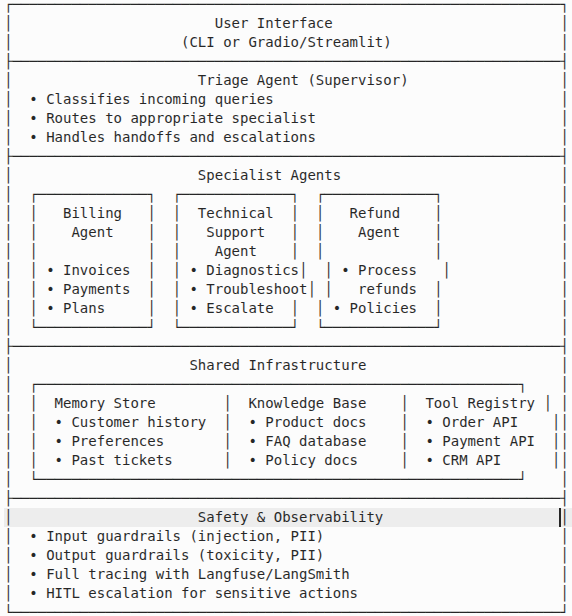

# Week 3: Tool Mastery & Assignments

Use the **track resources** to follow one path. Complete it then do the shared capstone below.

---

## Track resources

**[Track resources](../AI-Engineer-Bootcamp-Tracks.md)** — tables for:

- **Track A** — Cursor + Claude Code (Agentic IDE + Terminal Agents)
- **Track B** — GitHub Copilot (IDE Pair Programmer at Scale)
- **Track C** — OpenAI Codex (Delegation, CI, Automation)

Pick one track and work through its modules. Links and focus are in the resource.

---

## Phase 1: Shared Capstone (all tracks)

- Ship one real feature
- Tests passing
- Demo
- Time-to-merge and iteration metrics captured

## Phase 2: Capstone Project

**Multi-Agent Customer Support System**

Build a production-ready multi-agent customer support system that demonstrates mastery of all concepts covered in this accelerator. This system will handle customer inquiries by routing them to specialized agents, integrating with external systems, and maintaining conversation context with robust safety guardrails.


**Architecture**



- User Interface (CLI or Gradio/Streamlit)
- Triage Agent (Supervisor): Classify queries, route to specialists, handoffs
- Specialist Agents: Billing (invoices, payments, plans), Technical Support (diagnostics, troubleshoot, escalate), Refund (process refunds, policies)
- Shared: Memory store, Knowledge base, Tool registry
- Safety & Observability: Input/output guardrails, full tracing, HITL escalation

**Requirements**

| Requirement | Description | Acceptance Criteria |
|-------------|--------------------|--------------------|
| Multi-Agent Routing | Triage agent correctly routes to specialists | 90%+ routing accuracy on test cases |
| Tool Integration | Each specialist has domain-specific tools | At least 2 tools per agent |
| Memory Persistence | Customer context maintained across turns | Context recalled after 5+ turns |
| Agent Handoffs | Seamless transfer between agents | State preserved during handoff |
| HITL Checkpoints | Human approval for sensitive actions | Refunds > $50 require approval |
| Guardrails | Input/output safety checks | Block injection, mask PII |
| Observability | Full tracing and cost tracking | All LLM calls traced with costs |
| Evaluation | Automated test suite | 20+ test cases with scoring |

**Evaluation Rubric:** Architecture 20%, Functionality 25%, Safety 20%, Observability 15%, Code Quality 10%, Evaluation Suite 10%.

**Deliverables:** Source code (GitHub), README (architecture, setup, framework choice, limitations), test suite (20+ cases), optional 5-min demo video.

**Repository Setup Instructions**

```bash
# 1. Create a new repository on GitHub using your R Systems account
#    Repository name: agentic-ai-capstone-[your-name]

# 2. Clone and initialize
$ git clone https://github.com/[your-rsystems-username]/agentic-ai-capstone-[your-name].git
$ cd agentic-ai-capstone-[your-name]

# 3. Create project structure
$ mkdir -p src/{agents,tools,memory,guardrails} tests docs

# 4. Initialize with README
$ echo "# Agentic AI Capstone: Customer Support System" > README.md

# 5. Add collaborators (Settings → Collaborators → Add people)
#    - harshil-rsi
#    - surajpatilvelotio

# 6. Create initial commit
$ git add .
$ git commit -m "Initial project structure"
$ git push origin main
```